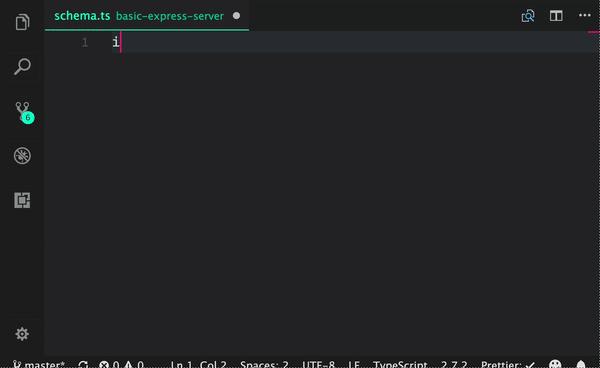

[](https://badge.fury.io/js/decapi)
[](https://david-dm.org/capaj/decapi)
[](https://codecov.io/gh/capaj/decapi)
[](https://travis-ci.org/capaj/decapi)

### What is `decapi`?



decapi is set of decorators allowing creating GraphQL APIs quickly and in type-safe way.

- [Documentation](https://decapi.netlify.com/)

### Examples:

- [Basic Express example](examples/basic-express-server)
- [Typeorm integration example](examples/typeorm-basic-integration)
- [Forward resolution - eg. query only needed db fields](examples/forward-resolution)
- [Nested mutations or queries](examples/nested-mutation-or-query)
- [Custom decorators / Higher order decorators](examples/custom-decorators)
- [Serverless eg. AWS Lambda](examples/serverless)
- [Merge schemas](examples/merge-schemas)

## Basic example

Example below is able to resolve such query

```graphql
query {
  hello(name: "Bob") # will resolve to 'Hello, Bob!'
}
```

```ts
import { Schema, Query, compileSchema } from 'decapi'

@Schema()
class SuperSchema {
  @Query()
  hello(name: string): string {
    return `Hello, ${name}!`
  }
}

const compiledSchema = compileSchema(SuperSchema)
```

`compiledSchema` is regular executable schema compatible with `graphql-js` library.

To use it with `express`, you'd have to simply:

```ts
import express from 'express'
import graphqlHTTP from 'express-graphql'

const app = express()

app.use(
  '/graphql',
  graphqlHTTP({
    schema: compiledSchema,
    graphiql: true
  })
)
app.listen(3000, () =>
  console.log('Graphql API ready on http://localhost:3000/graphql')
)
```

## Adding nested types

For now, our query field returned scalar (string). Let's return something more complex. Schema will look like:

```graphql
mutation {
  createProduct(name: "Chair", price: 99.99) {
    name
    price
    isExpensive
  }
}
```

Such query will have a bit more code and here it is:

```ts
import {
  Schema,
  Query,
  ObjectType,
  Field,
  Mutation,
  compileSchema
} from 'decapi'

@ObjectType({ description: 'Simple product object type' })
class Product {
  @Field()
  name: string

  @Field()
  price: number

  @Field()
  isExpensive() {
    return this.price > 50
  }
}

@Schema()
class SuperSchema {
  @Mutation()
  createProduct(name: string, price: number): Product {
    const product = new Product()
    product.name = name
    product.price = price
    return product
  }
}

const compiledSchema = compileSchema(SuperSchema)
```

## Forcing field type.

Since now, `decapi` was able to guess type of every field from typescript type definitions.

There are, however, some cases where we'd have to define them explicitly.

- We want to strictly tell if field is nullable or not
- We want to be explicit about if some `number` type is `Float` or `Int` (`GraphQLFloat` or `GraphQLInt`) etc
- Function we use returns type of `Promise<SomeType>` while field itself is typed as `SomeType`
- List (Array) type is used. (For now, typescript `Reflect` api is not able to guess type of single array item. This might change in the future)

Let's modify our `Product` so it has additional `categories` field that will return array of strings. For sake of readibility, I'll ommit all fields we've defined previously.

```ts
@ObjectType()
class Product {
  @Field({ type: [String] }) // note we can use any native type like GraphQLString!
  categories(): string[] {
    return ['Tables', 'Furniture']
  }
}
```

We've added `{ type: [String] }` as `@Field` options. Type can be anything that is resolvable to `GraphQL` type

- Native JS scalars: `String`, `Number`, `Boolean`, `Date`.
- Any type that is already compiled to `graphql` eg. `GraphQLFloat` or any type from external graphql library etc
- Every class decorated with `@ObjectType`
- One element array of any of above for list types eg. `[String]` or `[GraphQLFloat]`

## Writing Asynchronously

Every field function we write can be `async` and return `Promise`. Let's say, instead of hard-coding our categories, we want to fetch it from some external API:

```ts
@ObjectType()
class Product {
  @Field({ type: [String] }) // note we can use any native type like GraphQLString!
  async categories(): Promise<string[]> {
    const categories = await api.fetchCategories()
    return categories.map((cat) => cat.name)
  }
}
```

## Before `1.0.0`

Before version `1.0.0` consider APIs of `decapi` to be subject to change. We encourage you to try this library out and provide us feedback so we can polish it to be as usable and efficent as possible.

## Why forking?

I wanted to contribute to [typegql](https://github.com/prismake/typegql) and work on it together with @pie6k, but it soon became obvious that we both have something different in mind. Just to briefly summarise the differences:

- decapi has `@DuplexObjectType` and `@DuplexField`
- decapi has interfaces and mixins
- decapi can infer Date type
- InputObjectType argument passed ot your Field/Query is not just a plain object, but an instance of it's class
- decapi allows you to have an empty object type-you can populate it with fields at runtime
